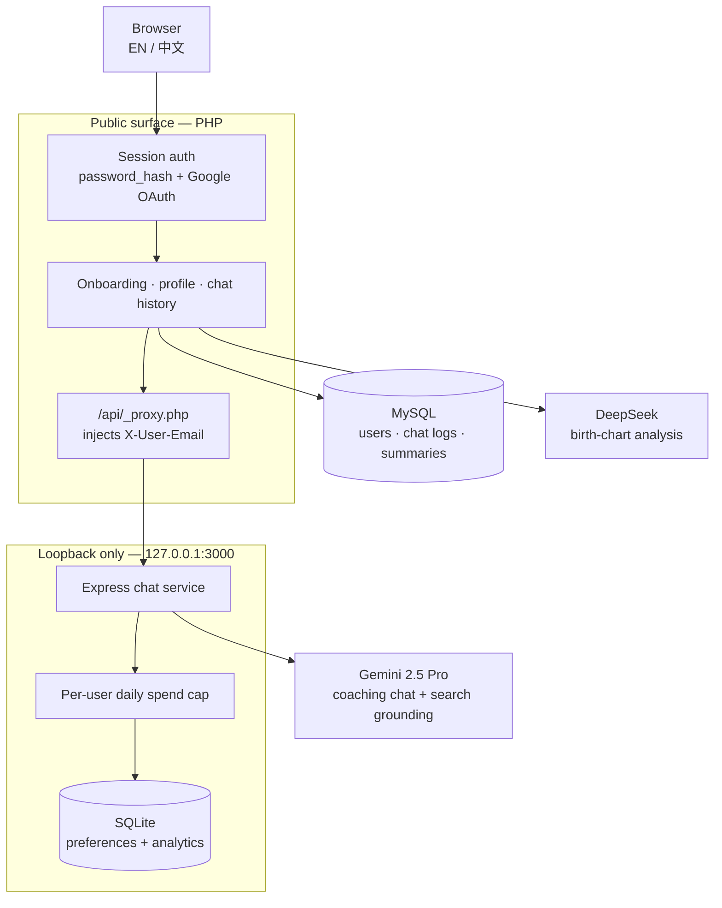

# askdcode.com — engineering case study

An AI life-coaching platform I built and have run since April 2025 for DCODE Sdn Bhd,
currently serving 20+ paying customers. Users complete an onboarding questionnaire and a
birth-chart reading, then hold ongoing coaching conversations with a model that has their
profile in context.

I built the whole thing: backend, front end, database, deployment, and ongoing support. I also
run it as sole proprietor — requirements, pricing, release cadence and customer support.

**This repository is a write-up, not the source.** The code belongs to the client and isn't
published. What follows is the architecture and the decisions behind it.

---

## Architecture



Two tiers, deliberately. The PHP application owns the user, the session and the durable data.
The Node service owns the conversation and the model calls. They talk over loopback only.

| | |
|---|---|
| **Front end** | PHP-rendered pages, vanilla JS, hand-written CSS; bilingual English / Chinese |
| **Application** | PHP 8 with PDO, session auth, Google OAuth sign-in, PHPMailer for transactional mail |
| **Chat service** | Node + Express — helmet, express-rate-limit, express-validator, winston |
| **Data** | MySQL for users, chat logs, history and summaries; SQLite for preferences and usage analytics |
| **Models** | DeepSeek `deepseek-chat` for the birth-chart reading; Gemini 2.5 Pro with Google Search grounding for coaching chat; Gemini 2.5 Flash on the lighter chat path |

---

## Three decisions worth explaining

### 1. Metering spend per user, because the unit economics are the product

The failure mode for a subscription product wrapped around a paid model API is simple: one
enthusiastic user talks to it all day and costs more than they pay. Rate limiting by request
count doesn't fix it — a long conversation with a big context costs many times what a short one
does, for the same single request.

So the service meters **money, not requests**. Every model response carries its token counts;
the service prices the call from them and writes it to an analytics table:

```
cost_myr = (output_tokens + thinking_tokens) × $10/M
         + input_tokens                      × $1.25/M
         all × 4.5 MYR/USD
```

Each user has a daily budget. Before generating, the service sums today's spend and refuses with
`429` if the cap is hit, returning the exact reset time — computed as 24 hours from the moment
the limit was first exceeded, read back out of the analytics log rather than reset at midnight,
so someone who hits the cap at 11pm isn't unblocked an hour later.

The same table doubles as the usage record: cost per user, per day, per conversation, queryable
after the fact. Pricing decisions come from it.

### 2. Capping conversation history, which halved the prompt bill

Every turn of a chat is resent as context on the next one, so an unbounded history means cost
grows quadratically over a conversation while adding little — coaching sessions rarely need
what was said forty turns ago.

The service keeps a sliding window of the last ten turns, dropping the oldest exchange each time
the window overflows. Long sessions stay at a flat context cost instead of compounding, and
**typical-session token spend fell by roughly half**. The user-facing quality difference was not
noticeable, because the user's profile — the part that actually personalises the coaching — is
injected through the system instruction on every call and is never subject to the window.

That profile comes from the onboarding questionnaire: age group, occupation, living situation,
relationship status, personality type, preferred coaching style, stress relievers and
problem-solving method. It's assembled into the system prompt so the model is oriented to the
user without spending conversation turns re-establishing it.

### 3. Giving the chat service no public surface at all

The Node service binds to `127.0.0.1` and is never exposed. Everything reaches it through a thin
PHP proxy that checks the session first and forwards the authenticated user's identity in a
header the client cannot set.

This means there is exactly one authentication system, in the tier that already owns the user
table, and the chat service can treat its caller as trusted. No token exchange between tiers, no
second session store to keep consistent, no CORS surface. The cost is that the tiers can't scale
independently — worth paying at this size, and the first thing I'd revisit if it grew.

The service also runs helmet, request-size limits, per-IP rate limiting, and schema validation on
every endpoint, with structured winston logging behind it.

---

## What I'd do differently

- **Responses aren't streamed.** The client waits on a complete generation, which on Gemini 2.5
  Pro with thinking enabled is a long visible pause. Streaming is the single biggest perceived-
  performance win available and it's the next thing I'd build.
- **Secrets are read from the environment, which is right, but there's no rotation story.** Keys
  live in the server environment and changing one is manual.
- **The password reset flow mails a generated password** rather than a single-use expiring link.
  It works, but a tokenised reset is the correct design and I'd replace it.
- **Two databases is one too many.** MySQL for the app and SQLite for the chat service happened
  because the tiers were built at different times. Preferences and analytics belong with
  everything else.
- **No automated tests.** The project has been maintained by one person who also runs the
  business, and testing lost to shipping. It's the thing that would most reduce the risk of
  changing it now.

---

## Notes

Built and maintained solo since April 2025. The platform is live and in paid use; source is
client-owned and not published here. Happy to talk through any part of it in more detail.
