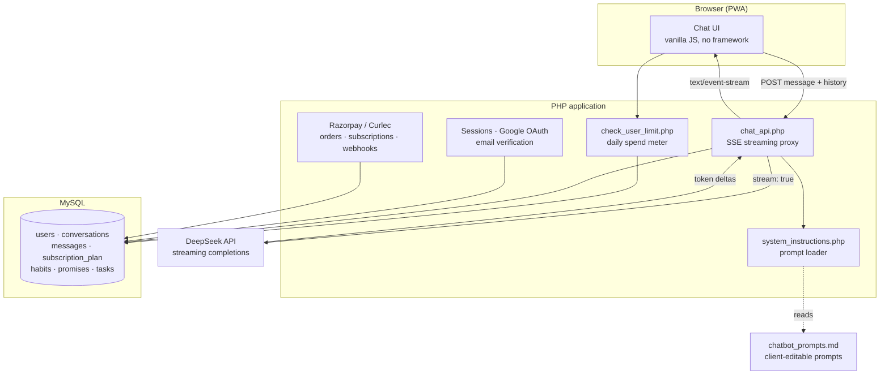

# askdcode — AI coaching platform

A subscription AI coaching product built for DCODE Sdn Bhd, a Malaysian leadership training
company. Users work through structured daily reflection and decision-making sessions with an
AI coach that holds them to commitments they have made.

I built and shipped the whole thing — backend, front end, payments, deployment and ongoing
support — and run it as sole proprietor. It currently serves 20+ paying subscribers.

> **This is a write-up, not a code repository.** The source belongs to the client and is not
> published. Everything below describes decisions and architecture rather than reproducing the
> implementation.

---

## Architecture

## Decisions worth explaining

**Token streaming through a PHP proxy.** The browser never talks to the model provider, so the
API key stays server-side and every message can be metered and persisted. `chat_api.php` opens a
streaming request to the provider and re-emits token deltas to the browser as Server-Sent Events,
with output buffering and gzip explicitly disabled so chunks actually reach the client instead of
sitting in a buffer until the response completes. Getting this right under shared hosting was
most of the work — the default PHP configuration buffers aggressively, which silently turns a
streaming endpoint into a slow non-streaming one.

**Per-message cost accounting.** Every model response is written to the `messages` table with its
own `api_cost`. A user's daily spend is the sum of that column over their conversations for the
current day in Asia/Kuala_Lumpur, compared against the `api_money` allowance attached to their
subscription plan. This means plan limits are denominated in actual inference cost rather than a
proxy like message count, so a user having a long, expensive conversation is charged against the
same budget as one having many short ones. It also means unit economics are queryable per user —
I can see directly whether a subscriber is profitable.

**Prompts live in a document, not in code.** The coaching methodology is the client's, not mine,
and it changes. Rather than embedding prompts in PHP, they live in a Markdown file where each
section is keyed by `## <coach> | <mode>` with the prompt in a fenced block. The loader parses
that file into sections and caches it for the request. The client edits their own coaching
prompts in a text file without touching code or needing a deploy, and the coach personas and
conversation modes become a two-dimensional lookup instead of a branching conditional.

**Subscription lifecycle handled through webhooks, not redirects.** Payment confirmation arrives
on the `subscription.charged`, `subscription.cancelled`, `subscription.halted` and
`payment.failed` webhooks rather than trusting the browser redirect after checkout, because users
close the tab. Recurring renewals, refunds and restoring a lapsed subscription are all driven off
the same event flow.

**Bilingual by default.** The product is primarily Simplified Chinese with English as an option,
and the language setting propagates into the prompt selection rather than only the interface —
the coach responds in the user's language because the system prompt says so, not because output
is translated afterwards.

## Stack

| | |
|---|---|
| **Front end** | Vanilla JavaScript, no framework. PWA manifest, installable on mobile |
| **Application** | PHP 8 with PDO, no framework. Session-based auth plus Google OAuth |
| **Database** | MySQL |
| **Model** | DeepSeek streaming completions |
| **Payments** | Razorpay / Curlec — one-off orders, recurring subscriptions, webhooks |
| **Email** | PHPMailer over SMTP for verification and password reset |
| **Node service** | Express with Helmet, rate limiting, request validation, Winston logging |

## Features

Multi-turn chat with persisted conversations, auto-generated titles and a history drawer ·
several coach personas across two conversation modes · habit, promise, task and commitment
tracking · structured reflection templates · onboarding questionnaire · free trial with
server-side gating · subscription management and self-service cancellation · account recovery ·
English and Simplified Chinese.

## What I would do differently

- **Conversation history grows unbounded.** The full transcript is sent on every turn, so cost
  per message climbs as a conversation gets longer. Summarising older turns and sending a
  rolling window would flatten that curve; this is the first thing I would change.
- **No framework means no migrations.** Schema changes are manual. Fine at this size, a liability
  if the data model keeps growing.
- **The PHP application is one flat directory of endpoints.** It works and it is easy to deploy
  on shared hosting, but there is no routing layer or shared middleware, so cross-cutting
  concerns like auth checks are repeated per file rather than applied once.

---

Built and maintained by [Zhengying Ho](https://github.com/zhengyingho) · Apr 2025 – present
